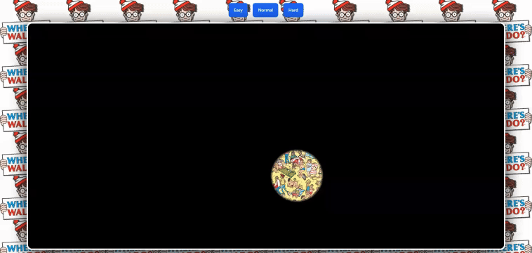

# About (InProgress)

Find My Waldo is a fun and challenging browser-based game where players must navigate through a cluttered webpage to find the iconic character, Waldo. The game introduces an exciting "spotlight cursor" effect, which only illuminates a small portion of the screen as you hover your mouse, adding an extra layer of difficulty. With three different difficulty levels – Easy, Normal, and Hard – the game promises an engaging experience for players of all skill levels.

# Project Demo (InProgress)

Here is a demo of how the project works:

Open [`eaf1.vercel.app`](https://findmywaldo.vercel.app/) with your browser to see the result.

## Stack Used

